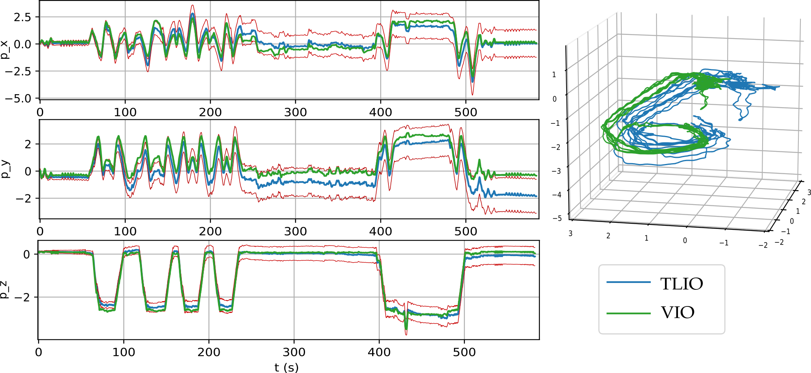
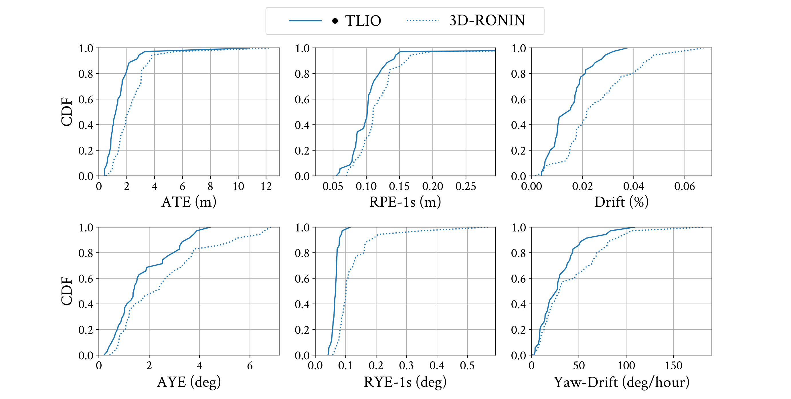
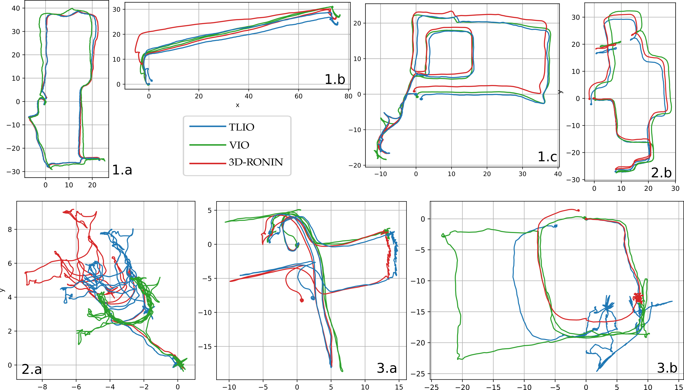
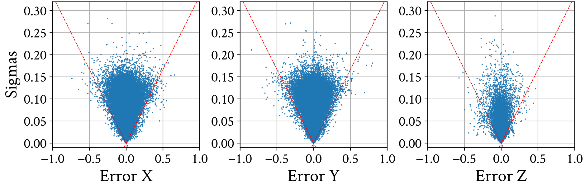
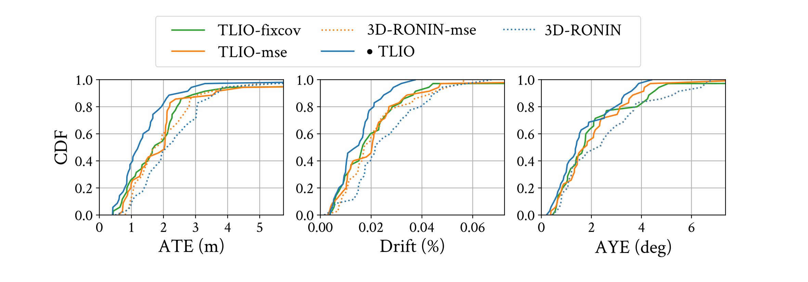
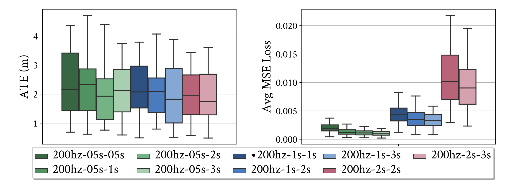
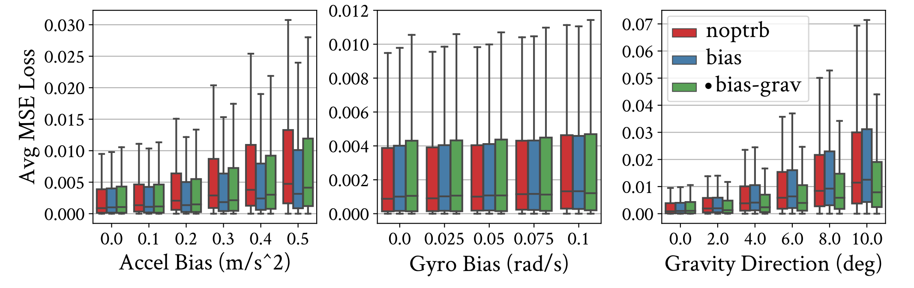
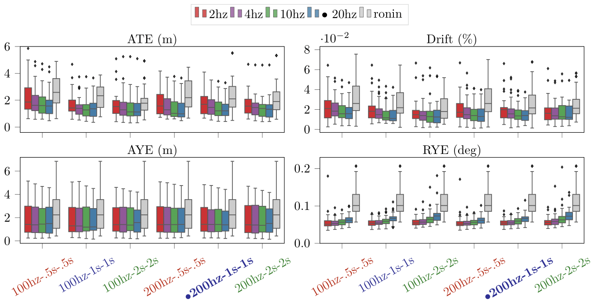

TLIO is an IMU-only pedestrian navigation approach combining deep learning and Bayesian filter. We recognize human motion patterns from 60 hours of training data consisting of various pedestrian activities, and fuse the learned relative state estimates and uncertainties into an EKF framework solving for pose, velocity and sensor biases.

## Publication

 

  <b>TLIO: Tight Learned Inertial Odometry</b> 
  <b>Wenxin Liu, David Caruso, Eddy Ilg, Jing Dong, Anastasios I. Mourikis, Kostas Daniilidis, Vijay Kumar, Jakob Engel</b> 
  Facebook Reality Labs, Redmond &nbsp; &nbsp; &nbsp; &nbsp; &nbsp; &nbsp; &nbsp; &nbsp; &nbsp; &nbsp; &nbsp; &nbsp; &nbsp; &nbsp; &nbsp; &nbsp; &nbsp; &nbsp; &nbsp; &nbsp; University of Pennsylvania, Philadelphia  

  

**Abstract**: In this work we propose a tightly-coupled Extended Kalman Filter framework for IMU-only state estimation. Strap-down IMU measurements provide relative state estimates based on IMU kinematic motion model. However the integration of measurements is sensitive to sensor bias and noise, causing significant drift within seconds. Recent research by Yan et al. (RoNIN) and Chen et al. (IONet) showed the capability of using trained neural networks to obtain accurate 2D displacement estimates from segments of IMU data and obtained good position estimates from concatenating them. This paper demonstrates a network that regresses 3D displacement estimates and its uncertainty, giving us the ability to tightly fuse the relative state measurement into a stochastic cloning EKF to solve for pose, velocity and sensor biases. We show that our network, trained with pedestrian data from a headset, can produce statistically consistent measurement and uncertainty to be used as update step in the filter, and the tightly-coupled system outperforms velocity integration approaches in position estimates, and AHRS attitude filter in orientation estimates.

- [Paper](https://drive.google.com/file/d/1CHNvUBrw7ZcT8Ruays8zMAcDwOUSsR6B/preview)
- [Code (Soon)]
- [Supplementary Video - Symposium](https://youtu.be/L9A1kE42apo)
- [Supplementary Video - Pool](https://youtu.be/WvTW9jQzP5o)
- [Supplementary Video - Staircase](https://youtu.be/Mw1UgA-bNW8)

## System

  

Our EKF system makes use of the output from the network as measurement update. The IMU buffer provides segments of gravity-aligned IMU measurements to the network, using rotation from the filter state. The network outputs displacement \\(\hat{\boldsymbol{d}}\\) and uncertainty \\(\hat{\boldsymbol{u}}\\) used as measurement update to the filter. The filter estimates rotation, velocity, position and IMU biases at IMU rate.

Our training data was collected with IMU and camera mounted on headsets. The network was trained first with MSE loss for the displacement for weight and bias initialization, then the maximum likelihood loss assuming Gaussian distribution. The displacement estimates provide constraints on pairs of past states (e.g. \\(\mathtt{R}_i\\) and \\(\mathtt{R}_j\\)) in the filter, and the filter keeps track of an array of past poses in the state as well as the current state and sensor biases.

## Performance
#### System evaluation

We compare TLIO to our [RONIN](https://ronin.cs.sfu.ca/) implementation in 3D. The ground truth for the error metrics is from a state-of-the-art Visual Inertial Odometry implementation based on [MSCKF](https://www-users.cs.umn.edu/~stergios/papers/ICRA07-MSCKF.pdf). 
  
Accurate bias estimates from the filter result in better orientation estimates than AHRS attitude filter. RONIN uses AHRS rotation while TLIO estimates the rotation as part of the state. TLIO also obtains better position estimates.
  

  

  
Sample trajectories in 2D. 3.a and 3.b are failure cases of side-stepping and rolling on a chair, which are not present in the training data.

  

  

Supplementary videos showing tracking in 3D (Blue: TLIO; red: 3D RoNIN; Green: VIO).

[[Symposium](https://youtu.be/L9A1kE42apo)]
[[Pool](https://youtu.be/WvTW9jQzP5o)]
[[Staircase](https://youtu.be/Mw1UgA-bNW8)]

#### Variation studies

We also analyzed different variants of the full system and the network component. Click for the results below and more details can be found in our [paper](https://drive.google.com/file/d/1CHNvUBrw7ZcT8Ruays8zMAcDwOUSsR6B/preview).

 Network output consistency 
 

 Using learned estimates for measurement updates in a Bayesian filter framework naturally raises the question of whether the estimates are consistent. Therefore we plotted the displacement errors vs. the standard deviation from the network uncertainty outputs. We observe that, trained with maximum likelihood loss, over 99% of the points fall inside the 3\(\sigma\) cone region indicated by the dashed red line. 

  

 Importance of the network covariance 
 

 Knowing that the network uncertainty estimate is consistent with the accuracy, would it help the system performance than simply finding a fixed covariance parameter? Here in this graph, both TLIO-mse and TLIO-fixcov use a hand-tuned hyperparameter from grid search, where in TLIO-mse the network does not regress the covariance. We observe clear improvements using the learned uncertainty for both accuracy and robustness, indicating the effectiveness of the network associating uncertainty with motion patterns. 

  

 Regressing with different data sizes 
 

 Another natural question to ask would be - can we improve the network accuracy by simply feeding more data? The answer is yes, but no for the system. We trained with various network input data sizes, including using past data. While we do observe a smaller MSE loss as we use more data, we do not observe a major difference on the metrics for the reconstructed trajectory. This is due to the increase in temporal correlation between data using overlapping time windows during velocity concatenation. 

  

 Network robustness 
 

 To make our network more robust to input noise, we trained using data augmentation techniques by perturbing the input with random bias and gravity direction noise. We observe on the test set that the network is more robust to input errors when trained with both gravity direction and bias perturbations. 

  

 System robustness 
 

 We show the full system performance comparison between different network input IMU frequencies, data window sizes, and filter update frequencies. We observe a consistent lower error and drift than RONIN-3D. These thorough experiments show the consistency and robustness of this proposed approach regardless of variations in the setting. 

  

