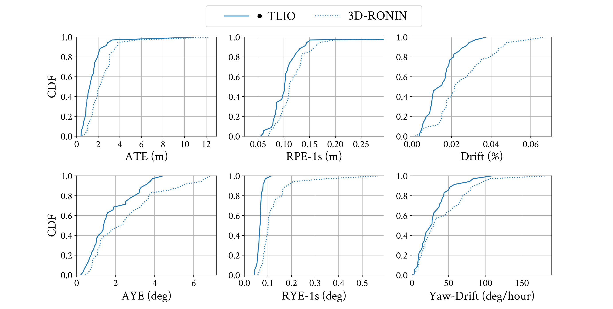
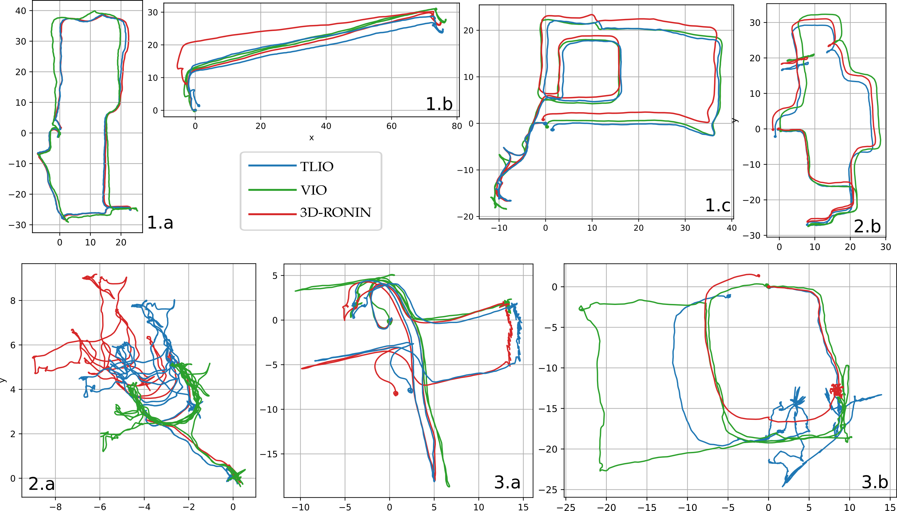

#### TLIO is an IMU-only pedestrian navigation approach combining deep learning and Bayesian filter. We recognize human motion patterns from 60 hours of training data consisting of various pedestrian activities, and fuse the learned relative state estimates and uncertainties into an EKF framework solving for pose, velocity and sensor biases.

## Publication

**IMU-Based Pedestrian Dead Reckoning with Learned Motion Model** \
Wenxin Liu, David Caruso, Eddy Ilg, Jing Dong, Anastasios I. Mourikis, Kostas Daniilidis, Vijay Kumar, Jakob Engel

  

**Abstract**: In this work we propose a tightly-coupled Extended Kalman Filter framework for IMU-only state estimation. Strap-down IMU measurements provide relative state estimates based on IMU kinematic motion model. However the integration of measurements is sensitive to sensor bias and noise, causing significant drift within seconds. Recent research by Yan et al. (RoNIN) and Chen et al. (IONet) showed the capability of using trained neural networks to obtain accurate 2D displacement estimates from segments of IMU data and obtained good position estimates from concatenating them. This paper demonstrates a network that regresses 3D displacement estimates and its uncertainty, giving us the ability to tightly fuse the relative state measurement into a stochastic cloning EKF to solve for pose, velocity and sensor biases. We show that our network, trained with pedestrian data from a headset, can produce statistically consistent measurement and uncertainty to be used as update step in the filter, and the tightly-coupled system outperforms velocity integration approaches in position estimates, and AHRS attitude filter in orientation estimates.

[Paper]
[Video]
[Code]

## Performance

We compare TLIO to our [RONIN](https://ronin.cs.sfu.ca/) implementation in 3D. The ground truth for the error metrics is from a state-of-the-art Visual Inertial Odometry implementation based on [MSCKF](https://www-users.cs.umn.edu/~stergios/papers/ICRA07-MSCKF.pdf). 

  
 Show figures 

  
  Accurate bias estimates from the filter result in better orientation estimates than AHRS attitude filter. RONIN uses AHRS rotation while TLIO estimates the rotation as part of the state. TLIO also obtains better position estimates.
  
  
  This image shows sample trajectories in 2D. 3.a and 3.b are failure cases of side-stepping and rolling on a chair.
  
  

Checkout these supplementary tracking videos (Blue: TLIO; Green: VIO)

[Staircase](https://drive.google.com/open?id=1NIZilMaIGx05EUPfztoMxiR2g8P3C0TM)
[Symposium]
[Pool]
[Apartment]

