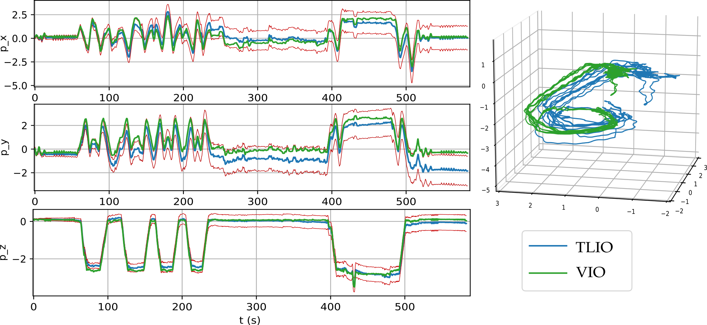

### *Welcome to TLIO home page!*

## Publication

This work aims at solving pedestrian state estimation problem with only IMU data, leveraging the combination of deep learning and Bayesian filters.

We propose a tightly-coupled Extended Kalman Filter framework for IMU-only state estimation. We train a network that regresses 3D displacement estimates and its uncertainty, and tightly fuse the relative state measurement into a stochastic cloning EKF solving for pose, velocity and sensor biases. We call this method **TLIO: Tight Learned Inertial Odometry**.

Here is a supplementary video showing tracking on staircases. (Blue: TLIO; Green: VIO)

[Staircase video](https://drive.google.com/open?id=1NIZilMaIGx05EUPfztoMxiR2g8P3C0TM)

More videos will be disclosed on this website soon!

